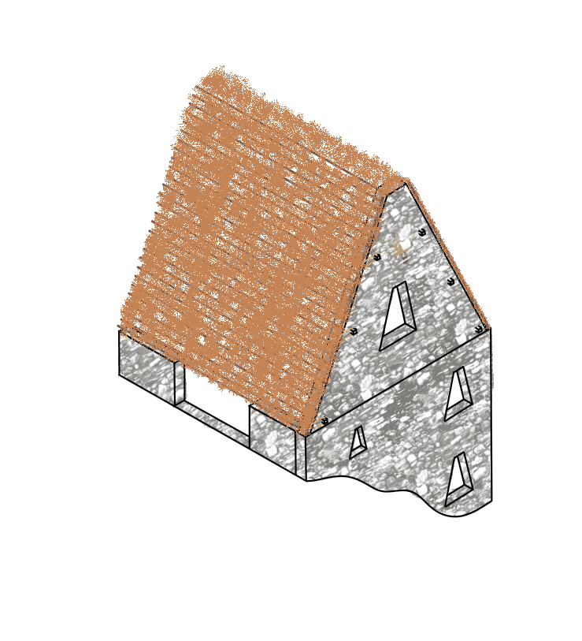

# The K'anchay (Light) Order
An organization that spans all of terrasa, working in the service of (Inti)[https://en.wikipedia.org/wiki/Inti], or Lathander, sun god of birth and renewal.

There are several types of K'anchay chapter:

## Locations
---

| Location  | Outlands Gate-Town | Outer Plane
|-----------|------------------------|------------------
| Monastery | Tradegate              | The Twin Paradises of Bytopia
| Temple    | Ecstasy                | The Blessed Fields of Elysium
| Chapel    | Ecstasy                | The Blessed Fields of Elysium
| Church    | Ecstasy                | The Blessed Fields of Elysium
| Garden    | Faunel                 | The Wilderness of the Beastlands
| Oasis     | Faunel                 | The Wilderness of the Beastlands

### Monasteries
---
Members at monasteries focus on studying ways to channel and manipulate radiant energy.  They're typically located in hard to reach areas, like the top of a mountain, or at the end of a long trek through a desert.  Settlements have cropped up near a few, as the families of people associated with the monasteries have followed them and expanded.  These settlements are mostly aligned in purpose with the K'anchay Order, supporting the monastery and the cause.  They are also the source of many of the martial personnel, as the monastery itself is inhabited mostly by Monks and Wizards.

#### Architecture
  - Mountains: Terraced enclaves with ashlar ("dry-stone", or mortarless stonework) structures and some small square tiered pyramid temples.
  - Desert: A complex of square tiered pyramids made of sandstone and shale, which serve as temples, dormitories, and trade houses.

#### Classes and Archetypes
  - Cleric
    - Forge Domain
  - Fighter
    - Arcane Archer
    - Eldritch Knight
  - Monk
    - Way of Mercy
    - Way of Shadow?
    - Way of the Kensei
    - Way of the Sun Soul
  - Paladin
    - Oath of Devotion
  - Rogue
    - Arcane Trickster
    - Inquisitive
    - Scout
  - Warlock
    - The Hexblade (Homebrew bond with a Sun Blade)
  - Wizard
    - Bladesinging
    - Order of the Scribe
    - School of Divination
    - School of Evocation
    - War Magic?

### Temples, Chapels, and Churches
---
Found in many cities, though most keep their ties to the K'anchay Order a secret.  These locations, when possible, are openly places of worship to Lathander.  When that is not possible, they are places of worship to other Good deities who's interests align with those of Lathander, or mutual enemies of Myrkul.  Training here focuses on a combination of martial prowess and channeling divine energy to destroy the forces of death.
  - Cleric
    - Life Domain
    - Light Domain
    - Peace Domain
  - Fighter
    - Battle Master
    - Champion
  - Paladin
    - Oath of Devotion
    - Oath of Redemption
  - Rogue
    - Inquisitive
  - Warlock
    - The Celestial (Homebrew Wall of Fire to Wall of Light?)

| Temple | Chapel | Church |
|--------|--------|--------|
|  |  |  |

### Gardens and Oases
---
Tucked into quiet corners of the world, these locations are habitats tended by those that wish to protect and maintain the natural world.  Often headed by Druids, Gardens and Oases tend to focus their training on survival in the wilderness, encouraging natural growth, and channeling the energy of the natural world and it's spirits and gods.  Gardens can be anything from a tended area of forest or prairie, to a curated botanical garden at a university.  Oases are islands of life in otherwise lifeless regions, usually the result of a spring, they exist in deserts and wastelands.
  - Barbarian
  - Cleric
    - Life Domain
    - Nature Domain
  - Druid
    - Circle of Stars
    - Circle of the Land
  - Paladin
    - Oath of the Ancients
  - Ranger
    - Horizon Walker (Homebrew force damage to radiant damage?)
    - Hunter
    - Monster Slayer
    - Swarmkeeper
  - Warlock
    - The Undying

## Travel Between Locations
---

Members of the K'anchay Order are able to travel between sites via portals to the gateway cities in the Outlands.  Travel is achieved through a re-skin of the [Astral Projection](https://www.dndbeyond.com/spells/astral-projection) spell which sends players to a particular location in the Outlands.  Less experienced members are chaperoned on their journeys, instructed not to stray, especially while traveling the region near Faunel.  This allows them to travel great distances often by simply walking a block or two through a Gate-Town, and doesn't technically violate the Cianni ban of teleportation circles.

### Monastery

Monasteries are connected to the region immediately surrounding Tradegate.  The public portions of their interiors are straightforward, though some rooms have apparently false door, which open into solid walls, or open cliff faces.  When their command word is spoken, these doors open into a mirror image of the monastery in the Outlands, near the city of Tradegate.  The two monasteries are exact mirror images of each other.

### Temples

### Chapels

The chaplain's chambers exist in both planes, simultaneously, allowing them quick access to both realms.  Chaplains act, in many ways, as the K'anchay Order's public ambassadors and recruiters in most cities.  Chapels are the most numerous of locations in the cities and towns of Sherago, and it is often important for the chaplains to meet with people from the Prime Material Plane, the Outlands, Elysium, The Beastlands, and Bytopia at once or in rapid succession.  To avoid confusion, their chambers typically have two doors, placed side by side, one leading to each plane.

### Churches

### Gardens

Trails through dense foliage, either forest, tall grass, reeds, or something similar, wind through the Garden.  When followed precisely, they end at the edge of a dense wood across a meadow from Faunel, in the middle of a garden within it, or rounding a large tree or boulder to find yourself coming out of a partially overgrown alley.  When you look over your shoulder the trail is no longer there, though occasionally you catch a glimmer of motion where there shouldn't be any, or the faint incongruous sound of the space you transitioned from.

### Oases

There is a small semicircular building next to the pool in the center of the oasis, the flat wall spanning a small portion of it, the wall disappearing beneath the surface.  A basin inside is filled with water drawn from the pool, which is still and glass-like.  The reflection in the surface of it shows the same room, with some subtle differences, a decoration is oriented differently, or is a different shade.  Perhaps most notably, your companions in the room aren't there, though you do catch some other people walking by.  When you touch the surface, it feels cool, but when you remove your hand, it is dry. Submerging in the pool is disorienting, as gravity seems to reverse itself, and when you break the surface, you are in the reflected room.

## Class Builds

### Barbarian
---

### Cleric
---

### Druid
---

### Fighter
---

### Monk
---

### Paladin
---

### Ranger
---

### Rogue
---

### Warlock
---

### Wizard
---

#### Spells
  - 3 Spirit Shroud (radiant)
  - 4 Sickening Radiance
  - 5 Dawn
  - 5 Wall of Light
  - 6 Sunbeam
  - 7 Crown of Stars
  - 8 Sunburst

## [Lightcraft](Lightcraft.md)

## Ranking System

[Inspiration](https://www.reddit.com/r/worldbuilding/comments/45n7p3/in_need_of_ranking_systemstitles/)

Affiliate
Novice
Initiate
Apprentice
Fellow

| Rank |   Chapel | Temple | Church | Monastery | Oasis | Garden |
|------|----------|--------|--------|-----------|-------|--------|
|    1 | Chaplain | Priest | Pastor |     Abbot |       |        |
|    2 | 
|    3 | 
|    4 | 
|    5 | 

