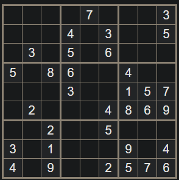
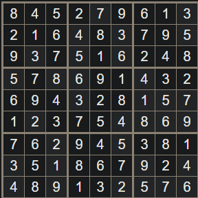
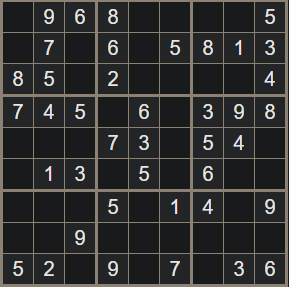
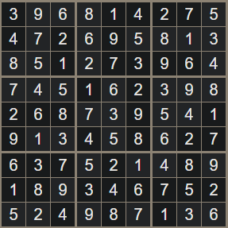
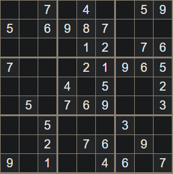
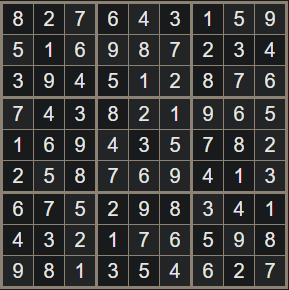

## K'anchay Order Investigations

Wayra must have had contacts in the city other than Sayre.  Sayre was able to win a turf war too quickly to have done it on her own, even with the help of a necromancer.  Her takeover was brutal, efficient, and quiet; it wasn't clear it was happening until it was almost complete, and even then, it wasn't obvious that the takeover was backed by an outside power.

**Mayua:** Llaska, despite his impetuousness, is an extremely talented scout and investigator

## Quipu Puzzles
Fairly easy sudoku with extra hints/checks encoded on the quipu which correspond in color to the puzzle.  They're the digits on the string, in order from left to right, top to bottom of the sudoku.

### Brother Gromag

| Orange | Green | Blue |
|--------|-------|------|
|    7   |   2   |   1  |
|    9   |   1   |   8  |
|    1   |   8   |   5  |

Numbers: 721, 918, 185

### Caltrop Bloodless

| Green | Blue | Orange |
|-------|------|--------|
|   2   |   1  |    3   |
|   4   |   7  |    6   |
|   3   |   4  |    2   |

Numbers: 213, 476, 342

### Gluteus Maximus

| Blue | Orange | Green |
|------|--------|-------|
|   5  |    2   |   2   |
|   1  |    4   |   3   |
|   4  |    7   |   1   |

Numbers: 522, 143, 471

### Combined Puzzle

Once they all have completed their individual puzzles (plans), they are dropped into some catacombs below the chapel through a trap door, which is shut behind them, disappearing.  After a moment, of darkness, some braziers on the wall spring to life.

#### Color 1

The chamber has a simple orange door on one wall, and the other three have a mural on them, covered in numbers.

Touching the right number on each wall will open the door.  Touching the wrong number causes a random negative effect.

Murals:
1. (791) The interior of a tavern or mess hall.  Succeed on a DC 15 investigation or DC 18 perception check, to notice that the mugs are not simply painted, but appear to be sculpted out of the stone of the wall.
2. (362) The aftermath of a battle, the ground littered with bodies and equipment.  In the foreground, set to one side, is a group of people wearing robes with a figure in shining plate armor leaning on their longsword.  The figure is looking pensively toward a group of wounded on the other side.  Succeed on a DC 15 investigation to determine that they're trying to reach wounded on the other side of a no-man's-land littered with tetrahedral spikes.  Succeed on a DC 18 perception check to notice the region littered with tetrahedral spikes.
3. (247) A dense treeline across a meadow, backed by snow-peaked mountains.  Succeed on a DC 15 investigation or DC 18 perception check, to see that perched on a branch near the center is a large bird of prey.

#### Color2

You enter a large chamber with a low ceiling, about 40' wide and 70' long.  The center is dominated by an 8 by 8 grid of 5' by 5' tiles.  Written left to right on the floor in front of you, spaced 5' apart, are the letters a through h written in green.  On the left wall, also spaced 5' apart, are the numbers 1 through 8, written in blue.  If Gluteus tries to fly across, DC 15 DEX to make it (low ceiling) or to fall on a random square, triggering an effect.  If he makes it across, the door is locked

Chessboard addressing with the numbers to indicate the safe squares.  Blue for Y axis, Green for X axis.

|         Character |  1  |  2  |  3  | Round
|-------------------|-----|-----|-----|-------
|    Brother Gromag | 1 b | 8 a | 5 h |
| Caltrop Bloodless | 1 b | 7 d | 4 c |
|   Gluteus Maximus | 5 b | 1 c | 4 a |

|   |   |   |   |   |   |   |   |   |
|---|---|---|---|---|---|---|---|---|
| 8 | b |   |   |   |   |   |   |   |
| 7 |   |   |   | c |   |   |   |   |
| 6 |   |   |   |   |   |   |   |   |
| 5 |   | g |   |   |   |   |   | b |
| 4 | g |   | c |   |   |   |   |   |
| 3 |   |   |   |   |   |   |   |   |
| 2 |   |   |   |   |   |   |   |   |
| 1 |   | bc| g |   |   |   |   |   |
|   | a | b | c | d | e | f | g | h |

#### Color3
Combat followed by a combination lock?

#### Final Chamber
Taruka Asto
Yori Olaya
Ilin Huaman
Hawka Chipana
Yuraq Cacha

The chaplain and <name>, the quartermaster, are there to offer the basis of their equipment and to guide them through the process of imbuing it with power.

## Other Puzzles

Eight Queens puzzle in person like in Indiana Jones

