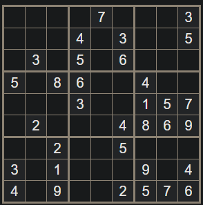
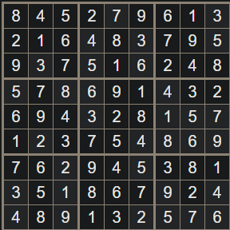
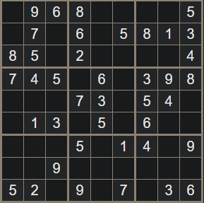
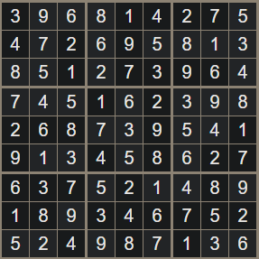
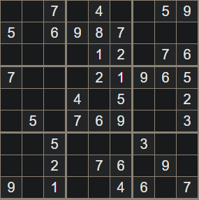
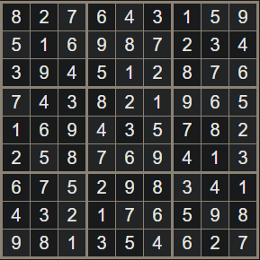

Down time, if they want it.  Nothing _pressing_ is going on, the order is investigating the recent events in the area.

## Yalaqta Random Events
<button id="YalaqtaRandomEvents" class="roll roll-click reset-contextmenu">Roll Event</button>

### 1. People from a nearby village are fleeing to Yalaqta
DC 12 Wisdom (perception) check to see or hear the villagers running toward the gate.  Some people are in the distance on the road, they don't appear to be organized the way a caravan or militia would be, but it does appear to be a fairly large group.
  

### 2. People from a nearby village have fled to Yalaqta
The party is hailed by a member of a group of refugees from a nearby village, who is begging for help.  Their village was overrun by undead and they fled to Yalaqta.  One cannot find his daughter, he last saw her after they entered the city and is worried that she was kidnapped or is lost in Yalaqta.  Another's siblings refused to leave the village, insisting that they could take it back (breadcrumb to go to the village and find them planning their assault, along with a couple other tradespeople from the village).

### 3. An accident in a necromancer's lab releases an abomination
A muffled BOOM emanates from a building just ahead.  DC 15 Wisdom (perception) to catch the shutters on a building shake, dust falling from them, and a small trickle of smoke to begin rising from them.  On a failure, as the party walks past, BANG, the door is smashed off the front and a monster burst out, engaging them.  On a success, if they investigate, they can peer through (Dexterity (stealth) 14) to see a Helmed Horror emerging from a basement, from which smoke is pouring.  It will start destroying some containers in the building before heading toward the door, which it will smash open, step into the street, and attack the nearest people it sees, unless the party intervenes first.
  

### 4. Servant for a mid-level noble discovers their necromancy

### 5. Servant for a mid-level noble finds a teleportation circle

### 6. Servant for a mid-level noble defects because they went too far

- Theft in the marketplace
- Fight or attack on a ship on the docks
- Pandora's box style encounter in or near a magic shop, the market, or docks

## K'anchay Order Investigations

Wayra must have had contacts in the city other than Sayre.  She was able to win a turf war too quickly to have done it on her own, even with the help of a necromancer.  Her takeover was brutal, efficient, and quiet; it wasn't clear it was happening until it was almost complete, and even then, it wasn't obvious that the takeover was backed by an outside power.

**Mayua:** Llaska, despite his impetuousness, is a talented scout and investigator

## Quipu Puzzles
Fairly easy sudoku with extra hints/checks encoded on the quipu which correspond in color to the puzzle.  They're the digits on the string, in order from left to right, top to bottom of the sudoku.

### Brother Gromag

| Orange | Green | Blue |
|--------|-------|------|
|    7   |   2   |   1  |
|    9   |   1   |   8  |
|    1   |   8   |   5  |

Numbers: 721, 918, 185

### Caltrop Bloodless

| Green | Blue | Orange |
|-------|------|--------|
|   2   |   1  |    3   |
|   4   |   7  |    6   |
|   3   |   4  |    2   |

Numbers: 213, 476, 342

### Gluteus Maximus

| Blue | Orange | Green |
|------|--------|-------|
|   5  |    2   |   2   |
|   1  |    4   |   3   |
|   4  |    7   |   1   |

Numbers: 522, 143, 471

### Combined Puzzle

Once they all have completed their individual puzzles (plans), they are dropped into some catacombs below the chapel through a trap door, which is shut behind them, disappearing.  After a moment, of darkness, some braziers on the wall spring to life.

#### Chamber 1

The chamber has a simple orange door on one wall, and the other three have a mural on them, covered in numbers.

Touching the right number on each wall will open the door.  Touching the wrong number causes a random negative effect.

Murals:
1. (791) The interior of a tavern or mess hall.  Succeed on a DC 15 investigation or DC 18 perception check, to notice that the mugs are not simply painted, but appear to be sculpted out of the stone of the wall.
2. (362) The aftermath of a battle, the ground littered with bodies and equipment.  In the foreground, set to one side, is a group of people wearing robes with a figure in shining plate armor leaning on their longsword.  The figure is looking pensively toward a group of wounded on the other side.  Succeed on a DC 15 investigation to determine that they're trying to reach wounded on the other side of a no-man's-land littered with tetrahedral spikes.  Succeed on a DC 18 perception check to notice the region littered with tetrahedral spikes.
3. (247) A dense treeline across a meadow, backed by snow-peaked mountains.  Succeed on a DC 15 investigation or DC 18 perception check, to see that perched on a branch near the center is a large bird of prey.

#### Chamber 2

You enter a large chamber with a low ceiling, about 40' wide and 70' long.  The center is dominated by an 8 by 8 grid of 5' by 5' tiles, that alternate black and white.  Written left to right on the floor in front of you, spaced 5' apart, are the letters a through h written in green.  On the left wall, also spaced 5' apart, are the numbers 1 through 8, written in blue.  If Gluteus tries to fly across, DC 15 DEX to make it (low ceiling) or to fall on a random square, triggering an effect.  If he makes it across, the door is locked.

Chessboard addressing with the numbers to indicate the safe squares.  Blue for Y axis, Green for X axis.

|         Character |  1  |  2  |  3  | Round
|-------------------|-----|-----|-----|-------
|    Brother Gromag | 1 b | 8 a | 5 h |
| Caltrop Bloodless | 1 b | 7 d | 4 c |
|   Gluteus Maximus | 5 b | 1 c | 4 a |

|   |   |   |   |   |   |   |   |   |
|---|---|---|---|---|---|---|---|---|
| 8 | b |   |   |   |   |   |   |   |
| 7 |   |   |   | c |   |   |   |   |
| 6 |   |   |   |   |   |   |   |   |
| 5 |   | g |   |   |   |   |   | b |
| 4 | g |   | c |   |   |   |   |   |
| 3 |   |   |   |   |   |   |   |   |
| 2 |   |   |   |   |   |   |   |   |
| 1 |   | bc| g |   |   |   |   |   |
|   | a | b | c | d | e | f | g | h |

#### Chamber 3

Taruka Asto
Yori Olaya
Ilin Huaman
Hawka Chipana
Yuraq Cacha

You enter the near the ceiling of a tall semi-circular room, with a narrow staircase carved into the stone to your right.  The floor is about 20' down, and slopes gently toward the center of the far wall.  There, you see a small semicircular depression in the floor, with narrow, shallow, channels radiating outward toward the walls.  Above it, on the wall, is a mural of a road and a river, heading up toward a city on a bluff overlooking a large bay.  Placed straddling each of the channels is a workbench, each with an array of different tools; blacksmith's tools, leatherworker's tools, even tinker's tools, and a jeweler's kit.  Standing near the center of the room, you see Mayua, and an older man with a shock of thin white hair.

Mayua and the quartermaster greet the party, congratulating them on solving their puzzles and making their way through the rooms.  They explain the process of fabrication and have a variety of base equipment available that can be used to craft their items.

Voice the quartermaster with "The Bernie."

